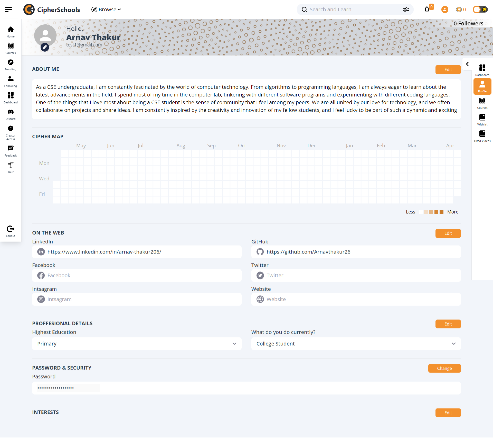
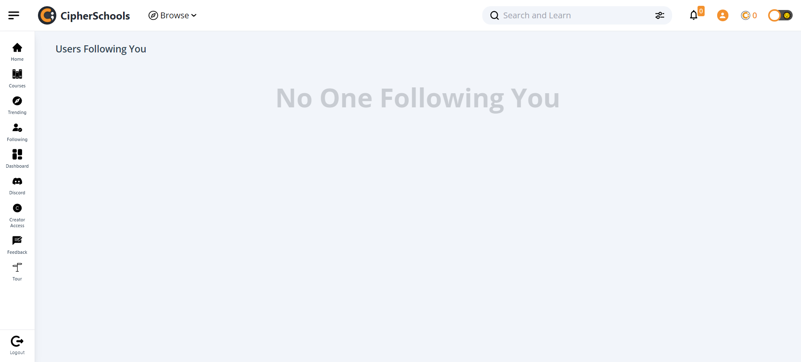
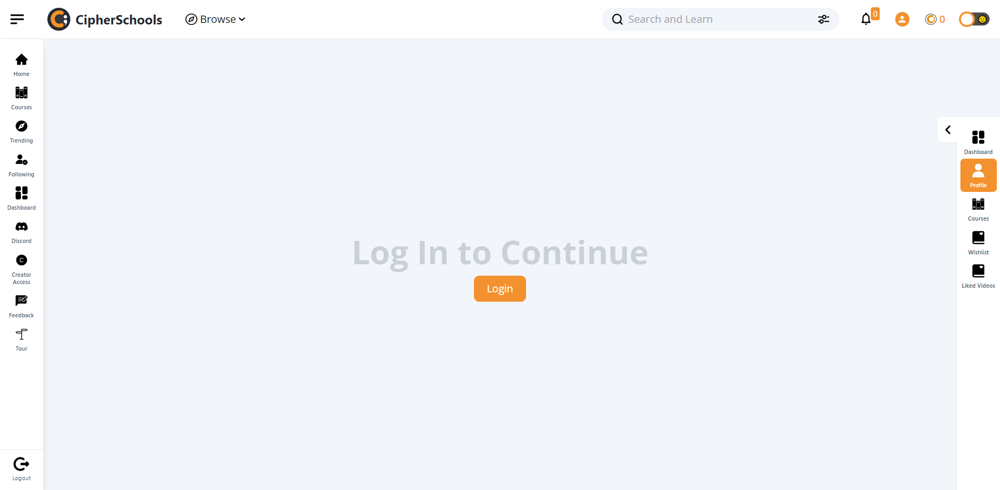

# CipherSchools Profile Page Clone

This is a project to replicate the CipherSchools Profile page. The project uses React JS and TailwindCSS for the frontend and NodeJS, ExpressJS, and MongoDB for the backend. The UI/UX is clean, responsive, and optimized, with features like updating user profile details, changing password, updating interests, and getting all follower details (paginated and optimized API).

## Installation

1. Clone this repository to your local machine.
2. Navigate to the project directory and run `npm install`.
3. Run the backend server using `nodemon index.js`.
4. Navigate to the frontend directory and run `npm install`.
5. Run the frontend using `npm run dev`.

## Features

- User registration
- User login
- Update user profile details
- Change password (password stored in encrypted form in the database)
- Update user interests
- Get all follower details (paginated and optimized API)

## Additional Features

- Cipher Map with added animation and personalized name
- Users can update their profile picture
- Users can see all the users who follow them

## Technologies Used

- React JS
- TailwindCSS
- NodeJS
- ExpressJS
- MongoDB

## Key Points

- Clean and responsive UI/UX
- Clean, structured, and optimized codebase
- Public Github repository with daily progress
- Input validation and error handling for all endpoints

## Reference Images

Please see the attached reference images for design inspiration. Additional UIs can be found by logging into a CipherSchools account and visiting the profile page.

